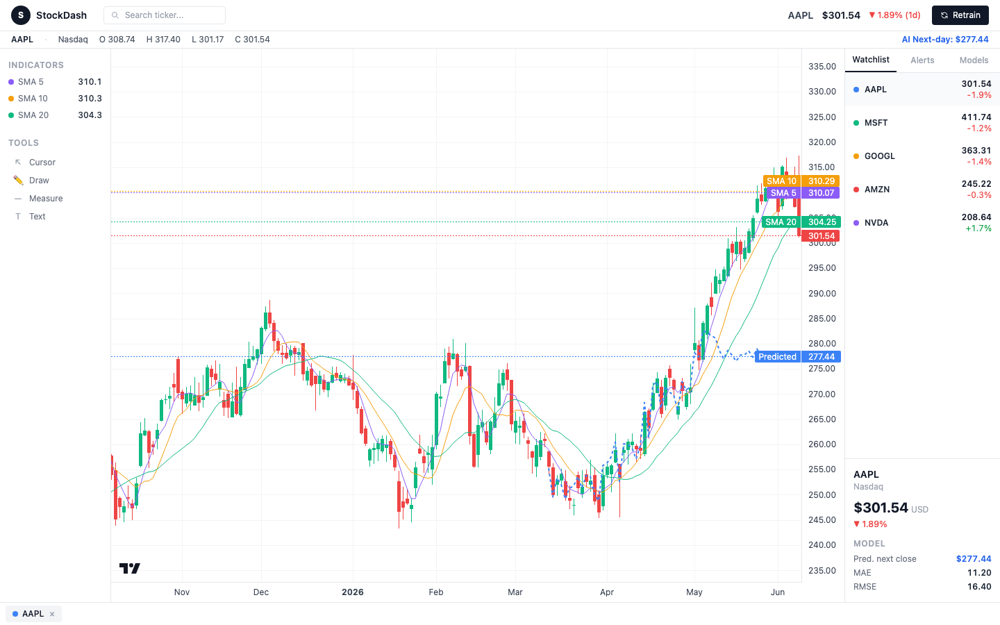

# StockDash

A self-retraining stock-prediction dashboard, built as an MLOps/platform-engineering portfolio
project. It runs a daily ingest → feature-engineering → train pipeline on a small watchlist of
tickers, serves predictions via a FastAPI backend, and renders them in a React trading-terminal UI.



## Features

- **Data pipeline** — pulls daily OHLCV history per ticker via `yfinance`, builds lagged/rolling
  features, and trains an XGBoost regressor to predict next-day closing price.
- **Self-retraining** — a scheduler re-runs the full pipeline on an interval (default daily),
  plus a manual "Retrain" button in the UI.
- **React dashboard** — candlestick chart (TradingView Lightweight Charts) with SMA overlays and
  a predicted-price line over the holdout window, a watchlist with live prices, and per-ticker
  model metrics (MAE/RMSE, predicted next close).
- **FastAPI backend** — thin JSON layer over the pipeline's parquet/model artifacts.
- **Dockerized** — `docker-compose up` runs the API, frontend, and retrain scheduler together.

## Architecture

```
ingestion/fetch.py     → data/raw/<TICKER>.parquet            (daily OHLCV via yfinance)
ingestion/features.py  → data/processed/<TICKER>.parquet      (lag features + next-day label)
training/train.py      → models/<TICKER>/model.json + metrics.json   (XGBoost regressor)
training/scheduler.py  → loops fetch → features → train on an interval

api/                    → FastAPI: GET /api/tickers, GET /api/chart/{ticker}, POST /api/retrain
frontend/               → React + Vite + Tailwind + TradingView Lightweight Charts
```

Each pipeline stage communicates only through the filesystem (parquet + JSON), so the API and UI
can be swapped or scaled independently of the pipeline.

## Watchlist

`AAPL`, `MSFT`, `GOOGL`, `AMZN`, `NVDA` (configurable in `config.py`).

## Quickstart (Docker)

```bash
docker compose up -d --build
```

- Dashboard: http://localhost:3000
- API: http://localhost:8000/api/tickers

The `scheduler` service runs the full pipeline once on startup (fetch + features + train for
every ticker), then daily after that. `data/` and `models/` are bind-mounted to the host, so
results persist across restarts.

```bash
docker compose down
```

## Quickstart (local dev)

Requires Python 3.12+ and Node 20+.

```bash
# Python environment
uv venv
source .venv/bin/activate
uv pip install -r requirements.txt

# Run the pipeline once to generate data + models
python -m training.scheduler  # Ctrl+C after the first run completes

# Backend
uvicorn api.main:app --reload --port 8000

# Frontend (separate terminal)
cd frontend
npm install
npm run dev
```

- Dashboard: http://localhost:5173
- API: http://localhost:8000

## API

| Endpoint              | Method | Description                                                  |
|------------------------|--------|---------------------------------------------------------------|
| `/api/tickers`          | GET    | Watchlist with latest price and 1-day % change                |
| `/api/chart/{ticker}`   | GET    | OHLCV history, SMA 5/10/20, holdout predictions, next-close prediction |
| `/api/retrain`          | POST   | Synchronously runs fetch → features → train for all tickers   |

## Testing

```bash
.venv/bin/pytest -v
```

## Roadmap

This project is built incrementally as a series of milestones (see `docs/superpowers/specs/`):

- [x] Milestone 1 — local pipeline + dashboard MVP
- [x] Milestone 2 — React trading-terminal UI + FastAPI backend
- [x] Milestone 3 — Docker / docker-compose
- [ ] CI/CD pipeline
- [ ] MLflow / W&B experiment tracking
- [ ] Kubernetes + Helm deployment
- [ ] Terraform / cloud storage
- [ ] GitOps (ArgoCD/Flux)
- [ ] Prometheus / Grafana observability
